# Intro to CI/CD Tutorial

This document will walk through implementing a simple CI/CD pipeline into a codebase using [CircleCI](https://circleci.com/).
The following will be demonstrated:

- Integrating CircleCI with a GitHub project
- A unittest for a Python Flask application
- Implementing a CI/CD pipeline in the codebase using a CircleCI config file in the project
- Building a Docker image
- Deploy the Docker image to [Docker Hub](https://hub.docker.com)

## Prerequisites

Before you get started you'll need to have these things:

- [GitHub Account](https://github.com/join)
- [CircleCI](https://circleci.com/signup/) account
- [Docker Hub account](https://hub.docker.com)
- Fork then clone the [cicd-101-workshop repo](https://github.com/datapunkz/python-cicd-workshop) locally

 After you have all the prerequisites complete you're ready to proceed to the next section.

## The App

This repo contains a simple python [Flask](http://flask.pocoo.org/) and you can find the complete [source code for this project here](https://github.com/datapunkz/python-cicd-workshop) and you can `git clone` it locally. The app is a simple web server that renders html when a request is made to it. The flask application lives in the `hello_world.py` file:

```python
from flask import Flask

app = Flask(__name__)

def wrap_html(message):
    html = """
        <html>
        <body>
            <div style='text-align:center;font-size:80px;'>
                <image height="340" width="1200" src="https://user-images.githubusercontent.com/194400/41597205-a57442ea-73c4-11e8-9591-61f5c83c7e66.png">
                <br>
                {0}<br>
            </div>
        </body>
        </html>""".format(message)
    return html

@app.route('/')
def hello_world():
    message = 'Welcome to CI/CD 101 using CircleCI'
    html = wrap_html(message)
    return html

if __name__ == '__main__':
    app.run(host='0.0.0.0', port=5000)
```

The key take away in this code the `message` variable within the `hello_world()` function.  This variable specifies a string value and the value of this variable will be tested for a match in a unittest.

## Testing Code

All code must be tested to ensure that quality stable code is being released to the public.  Python comes with a testing framework named [unittest](https://docs.python.org/2/library/unittest.html) which is used in this example.  The flask application has a companion unittest that will test the application and ensure it's functioning as designed. The file `test_hello_world.py` is the unittest for our hello_world.py app below is a quick explanation the code.

```python
import hello_world
import unittest

class TestHelloWorld(unittest.TestCase):

    def setUp(self):
        self.app = hello_world.app.test_client()
        self.app.testing = True

    def test_status_code(self):
        response = self.app.get('/')
        self.assertEqual(response.status_code, 200)
    
    def test_message(self):
        response = self.app.get('/')
        message = hello_world.wrap_html('Welcome to CI/CD 101 using CircleCI')
        self.assertEqual(response.data, message)

if __name__ == '__main__':
    unittest.main()
```

```python
import hello_world
import unittest
```

Import the `hello_world` application using the `import` statement which gives the test access to the code in the `hello_world.py`. Next import the `unittest` modules and start defining test coverage for the application.

`class TestHelloWorld(unittest.TestCase):`
The TestHelloWorld is instantiated from the base class `unittest.Test` which is the smallest unit of testing. It checks for a specific response to a particular set of inputs. unittest provides a base class, TestCase, which may be used to create new test cases.

```python
def setUp(self):
        self.app = hello_world.app.test_client()
        self.app.testing = True
```

`setUp()` is a class level method called to prepare the test fixture. This is called immediately before calling the test method. In this example we create define a variable named `app` and instantiate it as `app.test_client()` 
object from the hello_world.py code.

```python
def test_status_code(self):
    response = self.app.get('/')
    self.assertEqual(response.status_code, 200)
```

`test_status_code()` is a method and it specifies an actual test case in code.  This test case makes a `get` request to the flask application and captures the app's response in the `response` variable. The `self.assertEqual(response.status_code, 200)` compares the value of the `response.status_code` result to the expected value of `200` which signifies the `get` request was successful. If the server responds with a status_code other that 200 the test will fail.

```python
def test_message(self):
    response = self.app.get('/')
    message = hello_world.wrap_html('Welcome to CI/CD 101 using CircleCI')
    self.assertEqual(response.data, message)
```

`test_message()` is another method that specifies a different test case.  This test case is designed to check the value of the `message` variable that is defined in the `hello_world()` method from the hello_world.py code. Like the previous test a **get** call is made to the app and the results are captured in a `response` variable. The following line :

```python
message = hello_world.wrap_html('Welcome to CI/CD 101 using CircleCI')
```

The `message` variable is assigned the resulting html from the `hello_world.wrap_html()` helper method which is defined in the hello_world app.  The string `Welcome to CI/CD 101 using CircleCI` is supplied to the `wrap_html()` method which is then injected & returned in html. The `test_message()` will verify that the message variable in the app will match the expected string in this test case. If the strings don't match then the test will fail.

## CI/CD Pipeline using CircleCI

Now that the application and unit tests have been explained, it's time to implement a CI/CD pipeline into the codebase. Implementing a CI/CD pipeline using CircleCI is very simple. 

CircleCI integration is completed in basically two steps. 

1. Set up project access in CircleCI dashboard
2. Define your CI/CD Builds a `config.yml` file

Once project's are setup in the CircleCI platform any commits pushed upstream to the codebase will be detected and CircleCI will execute the job defined in your `config.yml` file which is discussed in the next section.

Before continuing ensure the [Prerequisites](#Prerequisites) section is completed. 

### .circleci/config.yml

The config.yml is where all of the CI/CD magic happens. The config.yml **must** reside in a subdirectory named `.circleci/`. Below is an example of the config.yml used in this tutorial with a brief explanation of the syntax:

```yaml
version: 2
jobs:
  build:
    docker:
      - image: circleci/python:2.7.14
        environment:
          FLASK_CONFIG: testing
    steps:
      - checkout
      - run:
          name: Setup VirtualEnv
          command: |
            echo 'export TAG=0.1.${CIRCLE_BUILD_NUM}' >> $BASH_ENV
            echo 'export IMAGE_NAME=cicd-101-workshop' >> $BASH_ENV 
            virtualenv helloworld
            . helloworld/bin/activate
            pip install --no-cache-dir -r requirements.txt
      - run:
          name: Run Tests
          command: |
            . helloworld/bin/activate
            python test_hello_world.py
      - setup_remote_docker:
          docker_layer_caching: true
      - run:
          name: Build and push Docker image
          command: |
            . helloworld/bin/activate
            pyinstaller -F hello_world.py
            docker build -t $DOCKER_LOGIN/$IMAGE_NAME:$TAG .
            echo $DOCKER_PWD | docker login -u $DOCKER_LOGIN --password-stdin
            docker push $DOCKER_LOGIN/$IMAGE_NAME:$TAG
```

The `jobs:` key represents a list of jobs that will be run.  A job encapsulates the actions to be executed. If you only have one job to run then you must give it a key name `build:` you can get more details about [jobs and builds here](https://circleci.com/docs/2.0/configuration-reference/#jobs)

The `build:` key is composed of a few elements:

- docker:
- steps:

The `docker:` key tells CircleCI to use a [docker executor](https://circleci.com/docs/2.0/configuration-reference/#docker) which means our build will be executed using docker containers.

`image: circleci/python:2.7.14` specifies the docker image that the build must use

### steps: 

The `steps:` key is a collection that specifies all of the commands that will be executed in this build. The first action that happens the `- checkout` command that basically performs a git clone of your code into the build environment.

The `- run:` keys specify commands to execute within the build.  Run keys have a `name:` parameter where you can label a grouping of commands. For example `name: Run Tests` groups the test related actions which helps organize and display build data within the CircleCI dashboard.

**Important NOTE:** Each `run` block is equivalent to separate/individual shells or terminals so commands that are configured or executed will not persist in latter run blocks. Use the `$BASH_ENV` work around in the [Tips & Tricks section](https://circleci.com/docs/2.0/migration/#tips-for-setting-up-circleci-20)

```yaml
- run:
    name: Setup VirtualEnv
    command: |
      echo 'export TAG=0.1.${CIRCLE_BUILD_NUM}' >> $BASH_ENV
      echo 'export IMAGE_NAME=python-circleci-docker' >> $BASH_ENV 
      virtualenv helloworld
      . helloworld/bin/activate
      pip install --no-cache-dir -r requirements.txt
```

The `command:` key for this run block has a list of commands to execute. These commands set the `$TAG` & `IMAGE_NAME` custom environment variables that will be used throughout this build. The remaining commands set up the [python virtualenv](https://virtualenv.pypa.io/en/stable/) & installs the Python dependencies specified in the `requirements.txt` file.

```yaml
- run:
    name: Run Tests
    command: |
      . helloworld/bin/activate
      python test_hello_world.py
```            

In this run block the command executes tests on our application and if these tests fail the entire build will fail and will require the developers to fix their code and recommit.

```yaml
- setup_remote_docker:
    docker_layer_caching: true
```

A requirement of this pipeline is to build a Docker image based on the app and pushing that image to Docker Hub. This run block specifies the [setup_remote_docker:](https://circleci.com/docs/2.0/glossary/#remote-docker) key which is a feature that enables building, running and pushing images to Docker registries from within a Docker executor job. When docker_layer_caching is set to true, CircleCI will try to reuse Docker Images (layers) built during a previous job or workflow. That is, every layer you built in a previous job will be accessible in the remote environment. However, in some cases your job may run in a clean environment, even if the configuration specifies `docker_layer_caching: true`.

```yaml
- run:
    name: Build and push Docker image
    command: |
      . helloworld/bin/activate
      pyinstaller -F hello_world.py
      docker build -t $DOCKER_LOGIN/$IMAGE_NAME:$TAG .
      echo $DOCKER_PWD | docker login -u $DOCKER_LOGIN --password-stdin
      docker push $DOCKER_LOGIN/$IMAGE_NAME:$TAG
```

The **Build and push Docker image** run block specifies the commands that package the application into a single binary using pyinstaller then continues on to the Docker image building process.

```yaml
docker build -t $DOCKER_LOGIN/$IMAGE_NAME:$TAG .
echo $DOCKER_PWD | docker login -u $DOCKER_LOGIN --password-stdin
docker push $DOCKER_LOGIN/$IMAGE_NAME:$TAG
```

The `echo $DOCKER_PWD | docker login -u $DOCKER_LOGIN --password-stdin` command uses the $DOCKER_LOGIN and $DOCKER_PWD env variables set in the CircleCI dashboard as credentials to login & push this image to Docker Hub.

These commands build the docker image based on the `Dockerfile` included in the repo. [Dockerfile](https://docs.docker.com/engine/reference/builder/) is the instruction on how to build the Docker image.

```yaml
FROM python:2.7.14

RUN mkdir /opt/hello_world/
WORKDIR /opt/hello_world/

COPY requirements.txt .
COPY dist/hello_world /opt/hello_world/

EXPOSE 80

CMD [ "./hello_world" ]
```

## Hands On with CircleCI

The application, unit tests and config.yml have been explained in detail and provide an initial understanding of how code bases, CI/CD concepts and using CircleCI to facilitate pipelines. The rest of this document will demonstrate how to integrate CircleCI into a user's CircleCI profile and executing CI/CD builds. The [cicd-101-workshop repo](https://github.com/datapunkz/python-cicd-workshop) will be used in this example.

### Add Project to CircleCI

In order for the CircleCI platform to integrate with projects it must have access to the codebase. This section demonstrates how to give CircleCI access to a project on Github via the CircleCi dashboard.

- Login to the [dashboard](http://circleci.com/vcs-authorize/)
- Click the **Add Project** icon on the left menu
- Choose the appropriate GitHub org from the dropdown in the top left

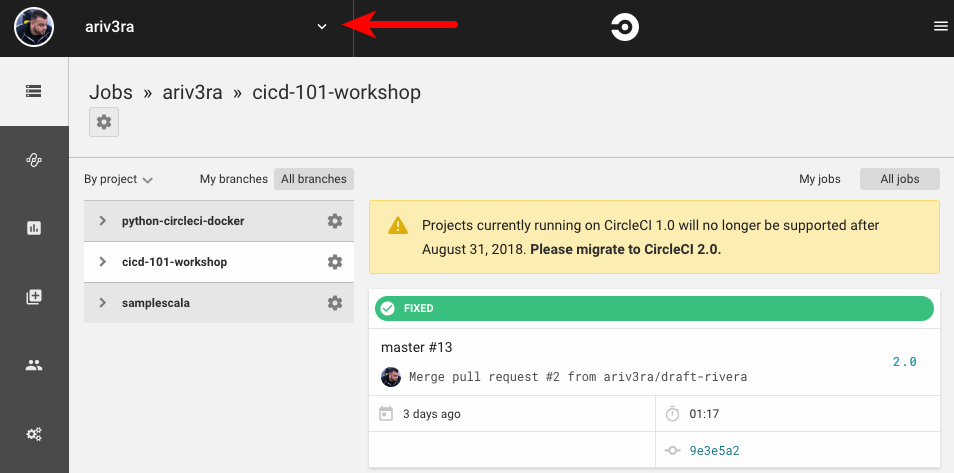

- Find the `cicd-101-workshop` project in the list
- Click the corresponding **Set Up Project** button on the right 

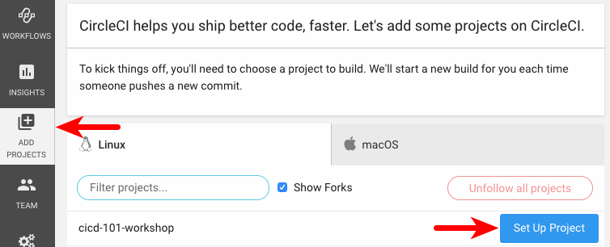

- On the `Set Up Project Section` click the **Other** button

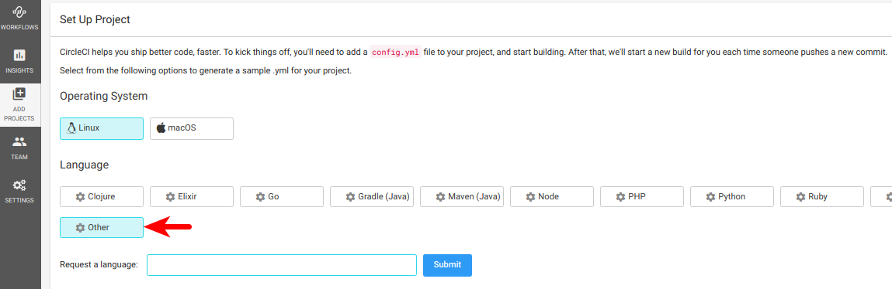

- Scroll down then click the **Start Building** button

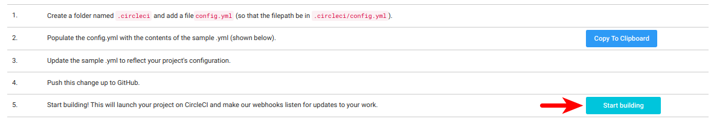

### Set Project Level Environment Variables

The build **will** fail because the CircleCI configuration uses environment variables `$DOCKER_LOGIN` and `$DOCKER_PWD` that are not configured. The following demonstrates how to set these variables.

- Click the project settings **cog** icon on the right

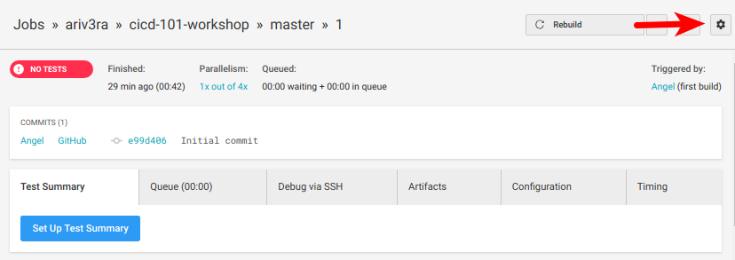

- From the `Project Overview` page click **Environment Variables** on the left

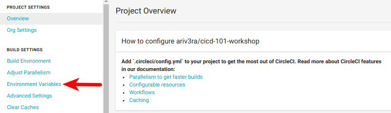

- Click **Add Variable** button

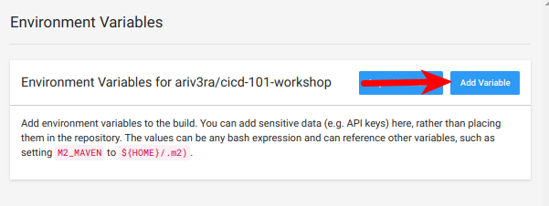

- Enter `DOCKER_LOGIN` in the **Name** field
- Enter your Docker Hub username in the **Value** field (Don't use your email address)
- Click **Add Variable** button


- Click the **Add Variable** button again
- Enter `DOCKER_PWD` in the **Name** field
- Enter your Docker Hub Password in the **Value** field
- Click **Add Variable** button

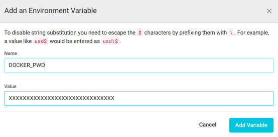  

The Environment Variables are defined and the build should now complete when rebuilt.

### Rebuild the Project

The project is properly configured and will build Green on the next run. To manually rebuild the failed project:

- Click the **Rebuild** button on the top right

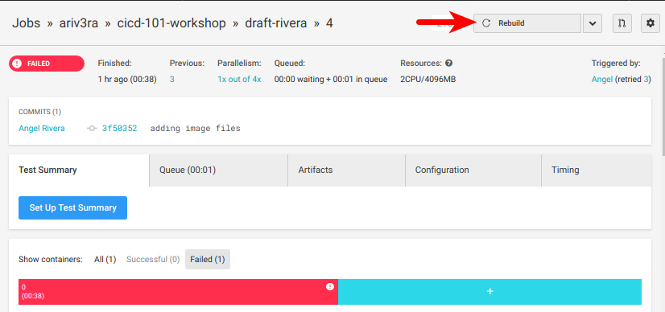

This run should produce a Green build!

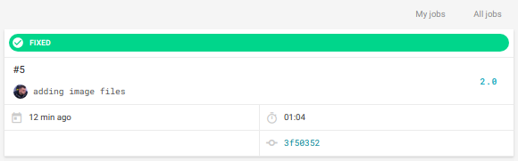

### Docker Hub

The Green build means that a new Docker image was created and pushed to the user's Docker Hub account. The newly created Docker image should be visible in the user's Docker hub tagged with the latest build number.

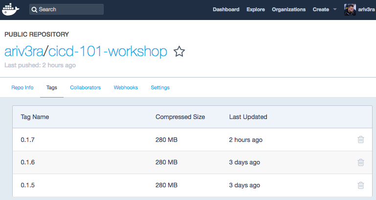

## Continuous Delivery/Deployment

Using the automation offered by CircleCI this project pushed the Docker image to the user's Docker Hub. The final requirement for this pipeline is to push a stable version of the application to Docker Hub which constitutes Continuous Deployment. If there would've been a manual action or user intervention required in this pipeline then it would be considered Continuous **Delivery** which is appropriate in situations where a review or an approval is required prior to actually deploying applications.

## Summary

In review this tutorial guides you in implementing a CI/CD pipeline into a codebase. Though this example is built using python technologies the general build, test and deployment concepts can easily be implemented in whatever language or framework you desire. The examples in this tutorial are simple but you can expand on them and tailor them to your pipelines. CircleCI has great [documentation](https://circleci.com/docs/2.0/) so don't hesitate to research the docs site and if you really get stuck you can also reach out to the CircleCI community via the [https://discuss.circleci.com/](https://discuss.circleci.com/) community/forum site.
